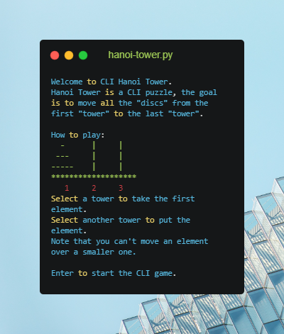
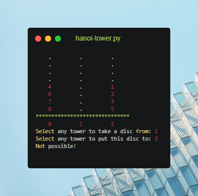
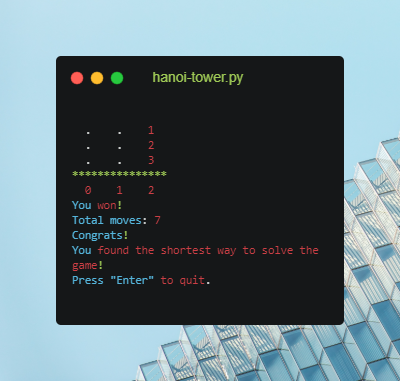

# CLI Hanoi Tower
[](https://www.python.org/)

CLI Hanoi Tower is a command-line puzzle written in Python.

[](https://github.com/Marfullsen/cli-hanoi-tower/blob/master/screenshot_01.png)

## Installation

```
git clone https://github.com/Marfullsen/cli-hanoi-tower.git
cd cli-hanoi-tower
python hanoi-tower.py
```

## How to play

Just read the splash message and enjoy!

## Easter eggs!

There are hidden Easter eggs to increase the difficulty!.

# Resources
- Carbon - [https://carbon.now.sh/](https://carbon.now.sh/)
- Background photo by Andre Benz on Unsplash - [https://unsplash.com](https://unsplash.com/photos/AiORnUT6sC0)

# Screenshots

[](https://github.com/Marfullsen/cli-hanoi-tower/blob/master/screenshot_02.png)

[](https://github.com/Marfullsen/cli-hanoi-tower/blob/master/screenshot_03.png)

## Contributing

Please open an issue to suggest changes.

## License

[Apache 2.0](http://www.apache.org/licenses/LICENSE-2.0)
